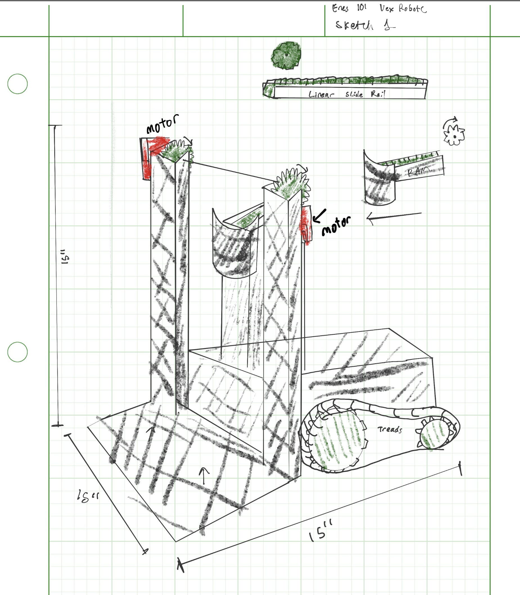
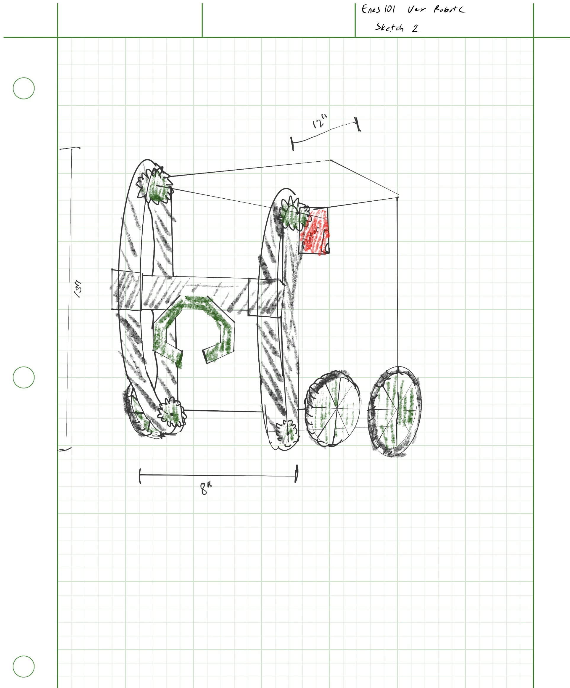
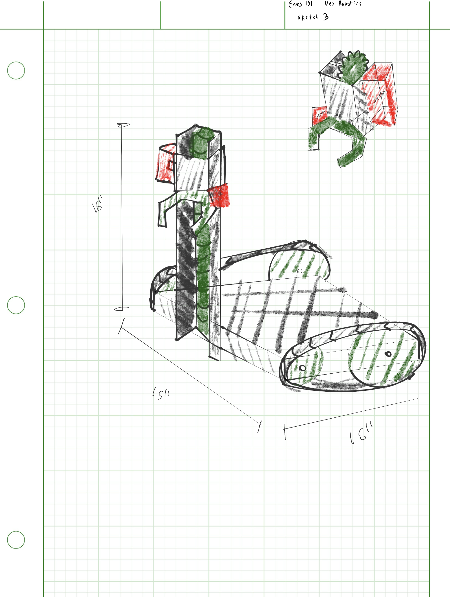
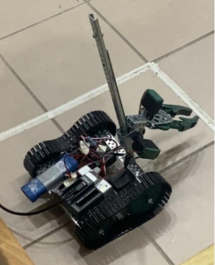
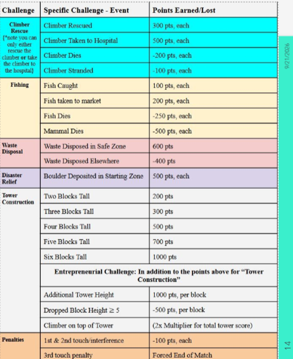

## Overview

This repository documents the 5-week engineering design and development process for the Autonomous Robotics Design Challenge. Working in a 4-person team, we designed, built, and programmed a functional VEX prototype robot to compete against other course teams on a $10'\times10'$ arena under strict physical, operational, and budgetary constraints[cite: 1].

---

contains the ROBOTC embedded source code, mechanical design sketches, financial component breakdown, and physical hardware validation for the VEX Autonomous Robotics Design Challenge.

## Technical Specifications

* **Language:** ROBOTC (`.c`)
* **Control Style:** State Machine & Continuous Edge Detection
* **Hardware Platform:** VEX Microcontroller, 393 Motors (High-Speed & Standard MC29), Rubber Tank Treads, Slide Rail Elevator, Servo Claw
* **Constraints:** $200 Budget, 24"x24" Max Footprint, Standard VEX Parts Only (No External Electronics or Adhesives)[cite: 1]

---

## Challenge Criteria & Objectives

The robot was designed to complete multiple scoring objectives while mitigating severe point penalties[cite: 1]:

* **Climber Rescue:** Transport climber to the tower or safely to the Hospital[cite: 1].
* **Hazard Cleanup:** Collect Waste Disposal containers and route to designated waste zone[cite: 1].
* **Fish Market Delivery:** Grab fish obstacles and deliver directly to Market[cite: 1].
* **Obstacle Clearance:** Clear roadblocks (rocks) from channels into Safe Zone[cite: 1].
* **Tower Construction:** Assemble structural blocks within Tower Construction Zone[cite: 1].

---

## Design Concepts & System Sketches

Initial structural concepts and mechanism layouts were drafted to plan component placement within the maximum size envelope.

*> Initial drive base and motor configuration layout.*

*> Slide rail elevator and vertical reach geometry.*

*> Detailed claw manipulator mechanism and servo attachment plan.*

---

## Hardware Construction & Final Build

The final robot assembly integrated a custom slide elevator and rubber tank treads to navigate field terrain and manipulate game objects.

*> Assembled VEX robot prototype showing tread drive, lift structure, and claw assembly.*

---

## System Architecture & Control Mapping

The robot control system operates via a custom ROBOTC program (`src/main.c`) utilizing independent tread channels, slide lift positioning, and single-button claw toggling:

* **Left / Right Tread Drive (`Btn5U/D` & `Btn6U/D`):** Dual-stick tank control powering rubber treads for pipe clearance.
* **Linear Slide Elevator (`Btn7U/D`):** Vertical axis drive for picking up ground objects and tower stacking.
* **Claw Toggle (`Btn8U`):** Rising-edge state switch toggling manipulator between open/closed positions.

---

## Engineering Challenges & Hardware Iterations

Hardware testing revealed several mechanical bottlenecks that required iterative redesigns prior to competition[cite: 1]:

* **Claw Span:** Initial design couldn't open wide enough; fixed by setting wider default resting angle[cite: 1].
* **Pipe Traversal:** Standard wheels lacked clearance; switched to tightened rubber tank treads[cite: 1].
* **Roadblock Pushing:** Straight-on pushing lacked torque; maxed motor profile speed and shifted pathing to push at an angle[cite: 1].
* **Ground Reach:** Slide rail kept claw elevated; angled claw downward to ensure ground-level clearance[cite: 1].

---

## Competition Results & Performance

Strategy targeted high-point objectives while steering clear of severe penalty zones (e.g., -500 pts for mammal casualties or dropped high blocks)[cite: 1].

*> Competition scoring breakdown and penalty matrix.*

* **Round 1 Score:** 2,400 pts[cite: 1]
  * **Driver 1:** Completed waste disposal and cleared tunnel roadblock[cite: 1].
  * **Driver 2:** Delivered climbers to hospital, built 3-block tower, and moved rock to safe zone[cite: 1].
* **Round 2 Score:** 900 pts[cite: 1]
  * **Driver 1:** Executed waste disposal[cite: 1].
  * **Driver 2:** Delivered climbers safely to hospital[cite: 1].

---

## Financial Analysis & Cost Breakdown

* View full cost ledger: **[`Cost_Sheet.xlsx`](docs/Cost_Sheet.xlsx)**

*> Overview of physical components, structural parts, and total project expenditure.*
